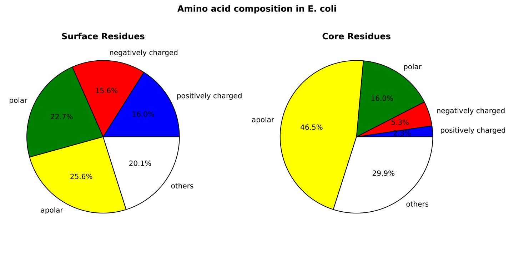
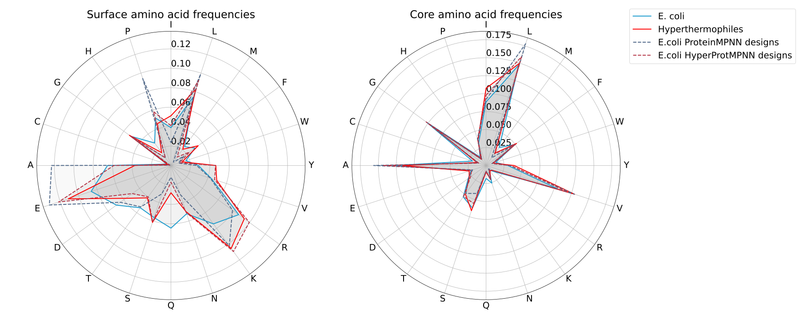
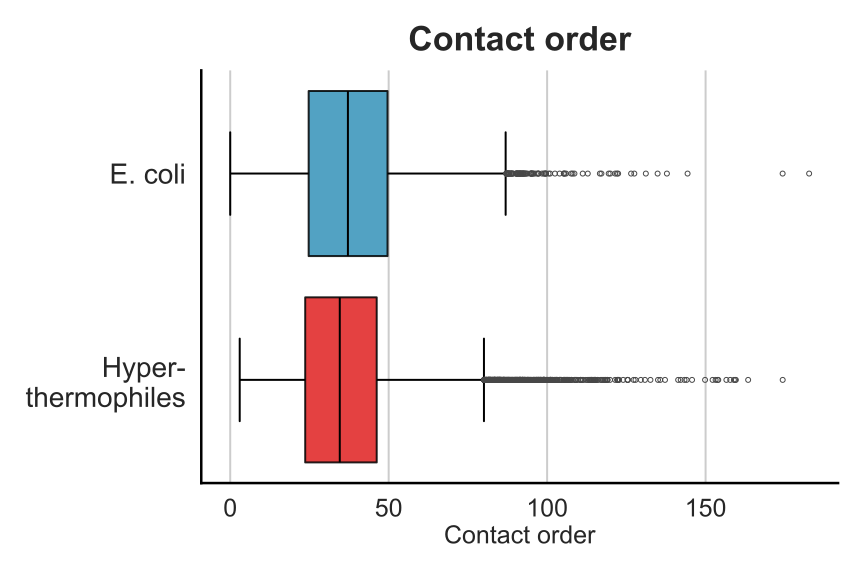

## Introduction

This repo contains the functions and methods for the paper 

**HyperMPNN ‒ A general strategy to design thermostable proteins learned from hyperthermophilic organisms**

**LINK/DOI**

and is primarily intended for the reproduction of the results. Additionally the weights for the different training settings (added backbone noise) are also included in this repository under `retrained_models` and can be used with the original [ProteinMPNN](https://doi.org/10.1126/science.add2187). All credit for the architecture and training scripts goes to the authors of ProteinMPNN and we would like to take this opportunity to thank them for making everything open source and available to the general public.

## General structure

This repository contains several folders (sections named after them) for which we give a brief overview in the next few sections. 

### af_models

In the `af_models` folder are two files called `ids_[ecoli|thermophilic].*`, containing the UniProt ids for all models used in the analysis and training. The ids belong to the proteins after the sequence clustering and plddt filter (keep > 70) step. You can download them by using the provided script and store them in two separate folders. The example workflow could look like the following:
```
cd af_models
mkdir -p ecoli_alphaFold_models hyperthermo_alphaFold_models
bash download_alphafold_structures.sh ids_ecoli.after_filter.list ecoli_alphaFold_models
bash download_alphafold_structures.sh ids_thermophilic.after_filter.list hyperthermo_alphaFold_models
```

All downloaded structures were processed again, i.e. long N and C terminal regions with a poor pLDDT value of less than 70 were truncated. You use the function `filter_pLDDT.py` in the `af_models` folder to do this and the command could look like the following below. **The `20` in the command belongs to the number of cores used for filtering. That depends a lot on your machine!** 

For the script you also need to **install** `pyrosetta`, `pandas`, `numpy` and `tqdm`.
```
mkdir -p ecoli_filtered hyperthermo_filtered
python3 ecoli_alphaFold_models ecoli_filtered 20
python3 hyperthermo_alphaFold_models hyperthermo_filtered 20
```

### calc_frequencies

This folder contains a jupyter notebook called `calc_structural_aa_frequencies.ipynb` to perform the calculation of amino acid frequencies for wild type and designed structures. **All data, which was collected for native and designed structures, is stored in the folder `calc_frequencies/data` in `pickle` files.** 

Based on the filtered and truncated structures, the frequencies of all amino acids are calculated for the *E.coli* and hyperthermophilic organisms. The amino acids are then divided into different groups (e.g. positively/negatively charged) and visualized. The code for this can be found in **section 2** of the notebook and an example figure looks like the following:



After the training of ProteinMPNN with structures from hyperthermophilic organisms (named HyperMPNN), both *E.coli* and hyperthermophilic structures were designed with default ProteinMPNN and HyperMPNN in a one-shot sequence prediction approach. Afterwards the changed frequencies of amino acids were visualized in radar plot. An example is shown below. The code for this can be found in **section 3** of the notebook and an example figure looks like the following




### calc_metrics

This folder contains a jupyter notebook called `calc_structural_packing_metrics.ipynb` to perform the calculation of packing metrics like contact order, charge distribution, salt bridges, radius of gyration and others. The calculation was performed for native and designed for collected structures of *E.coli* and hyperthermophilic organisms from previous steps. **All data, which was collected for native and designed structures, is stored in the folder `calc_metrics/data` in `pickle` files.** 

The notebook is devided in three sections. The first calculates the metrics, the second visualizes the results and in the third section the salt bridges are calculated separately. The visualisation of e.g the contact order distribution is shown below. 




### I53-50B_4PT1_design

In this folder all scripts for the design approach of the I53-50B.4PT1 pentamer for experimental validation of the new weights. The full structure was downloaded from the [PDB 6P6F](https://www.rcsb.org/structure/6P6F) and the pentamer manually extracted. After renumbering the three scripts (prefix `1_` to `3_`) were executed one after the other for the selection of the interface (`01_command_selection.sh`), the design using the new weights (`02_command_design.sh`) and the generation of a consensus sequence using the top scoring sequences based on ProteinMPNN's global score (`3_command_consensus.sh`).

### mpnn_retrain_docu

This folder contains everything to retrain ProteinMPNN using new structures. **At this point please refer to the README in the folder**.