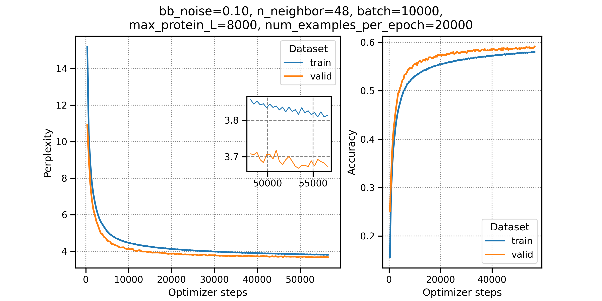

## Acknowledgement

This folder contains everything to retrain [ProteinMPNN](https://github.com/dauparas/ProteinMPNN) (GitLink) using
`.pdb` files. The scripts are only adapted from the original repository.

## Introduction

The title is quite obvious: we want to retrain [ProteinMPNN](https://doi.org/10.1126/science.add2187) (Paper link) for a specific case where the structures may contain information different from the original used - for example, purely in-silico models from [AlphaFold](https://doi.org/10.1038/s41586-021-03819-2) (Paper link) for highly thermostable proteins.

The workflow we will present here works for `.pdb` structures. We rewrote the parsing script from the original repo and modified the training scripts provided by the authors slightly. We are not sure if the script also creates the correct information for multi-chain proteins because ProteinMPNN uses a translational matrix for the correct positioning, and for now, we don't know how to calculate them from the pdb (they use a `CIF` parsing). **However, we highly recommend using single-chain proteins as input.**

## Preparation

### Specific format

We need a specific folder structure and an additional script for alignment. For now we don't use the alignment information, but it is easier to include them for later steps so that the training scripts don't break. However, we need to **create the following folders**:
```
mkdir -p chunk cluster_data pdb_pt data_files input_pdb
```

| Folder | Description |
| --- | --- |
| `chunk` | I split the input_pdb structures into multiple chunks to create the input tensors. I do that locally on multiple cores and use the chunks for individual processes. Of course, you can also create them with a different approach. |
| `cluster_data` | Contain files created from the cluster algorithm mmseq. The clusters acts later as an dictionary, from where the training script samples the structures and therefore, we need this information for consistency reasons. |
| `pdb_pt` | Location to store the input tensors. |
| `data_files` | Contain the later cluster ids for the training, validation, and testing datasets. We will also store a list of all models, clusters, and sequences here. For training, I save the created dictionaries from the training script in the folder checkpoints to skip the loading part. |
| `input_pdb` | The models we want to use. Here, we use pdb files. **Copy your pdb files to this directory!** |

```
|__ chunk
|__ cluster_data
|__ data_files
|__ input_pdb
|__ pdb_pt
|__ scripts
|  |__ 1_create_id_map.sh
|  |__ 2_make_all_pt_files.sh
|  |__ 3_clustering.sh
|  |__ 4_create_training_cluster.sh
|  |__ 5_run_local_training.sh
|  |__ create_cluster_lists.py
|  |__ get_multifasta_from_pdb_path.py
|  |__ helper_create_pt_files.sh
|  |__ parse_pdb_noX.py
|__ model_utils.py
|__ training.py
|__ utils.py
```


### Software

Before proceeding, we need additional software packages. Install them in your current environment and, if needed, adjust the path in the relevant scripts.

- [MMseqs2](https://github.com/soedinglab/MMseqs2)
- [TMalgin](https://zhanggroup.org/TM-align/TMalign.cpp)
    - Download the `cpp` and follow the instructions in the header
    - adapt the script in `scripts/parse_pdb_noX.py` by replacing the variable `TM_ALIGN_PATH` on line 15 with your path to the binary executable
    - `TM_ALIGN_PATH = "YOUR/FULL/PATH/TMalign"`
- [Pytorch](https://pytorch.org/get-started/locally/)
    - Please install it using the instructions on the website. Try to get `GPU` support for later training.
- Biopython, scikit-learn


## Preprocessing

When all pdbs are stored in the `input_pdb` directory, we use the scripts provided in the `scripts` directory to create some of our needed files for later training. Run the scripts in the order indicated by their name (don't change any path unless you know what you are doing). A short description of every script and which files are created is shown in the table below. The only script you maybe should adapt is the `2_make_all_pt_files.sh` to get the best split and CPU processes for computing, but that is not necessary

**Of course, if you change the names of paths in some scripts, you also must adapt them in every other script. But please don't do that and just run them as they are. Instead, maybe you get errors.**

```
> cd scripts/
> bash 1_create_id_map.sh
> bash 2_make_all_pt_files.sh           # <- MAKE It FASTER WITH BEST SPLIT  
> bash 3_clustering.sh
> bash 4_create_training_cluster.sh
```

| Script | Description | Created files |
| --- | --- | --- |
| `1_create_id_map.sh` | Read the pdb models from the input_path path and creates a txt file, which maps every generated 4-letter id to the corresponding pdb. A maximum of 1,679,616 unique ids/structures is possible. | `data_files/id_map.txt` |
| `2_make_all_pt_files.sh` | **Takes the major amount of time!** <br> Based on the generated `id_map` the script creates chunk files containing splits of the `id_map` to process them in parallel. **Change** the `n_splits` (number of ids per chunk) and `n_process` (number of processes for xargs) variables depending on your needs. The default is 2000 structures per chunk and 20 processes! For every structure `NAME` in the `input_pdb` path, two (or more) files called `NAME.pt` and `NAME_A.pt` containing the **input tensors** for the training script are created. | `chunk/chunk_*`,<br> `pdb_pt/NAME*.pt` |
| `3_clustering.sh` | Clustering of all sequences of `pdb`s from the `input_pdb` path. Uses `mmseqs` with **0.3 sequence identity** and store them in the `cluster_data` path. Beforehand a `fasta` file containing all sequences is created. An example of the major file `.tsv` can seen below, which maps representative and member sequences. If you don't want to use the script in the directory provide a new `fasta` file containing all sequences. | `cluster_data/myinput_mpnn.fasta`,<br> `cluster_data/myinput_cluster.tsv`,<br> (other files from mmseq2) |
| `4_create_training_cluster.sh` | Takes the tensor path pdb_pt and the created cluster file .tsv, which gives every cluster a representative, as input and creates the random training, validation and test cluster. From these clusters the training script will sample structures. | `data_files/list_cluster.csv`,<br>`data_files/train_cluster.txt`,<br>`data_files/valid_cluster.txt`,<br>`data_files/test_cluster.txt` |

Example `.tsv` file:
The file `AF-B7IH34-F1-model_v4_chain_A` is here the representative of a cluster containing the other 3 structures.
```
AF-A0A7C4D831-F1-model_v4_chain_A	AF-A0A7C4D831-F1-model_v4_chain_A
AF-A0A7C4D831-F1-model_v4_chain_A	AF-A0A7C4NLM3-F1-model_v4_chain_A
AF-B7IH34-F1-model_v4_chain_A	    AF-B7IH34-F1-model_v4_chain_A
AF-B7IH34-F1-model_v4_chain_A	    AF-F7YUY8-F1-model_v4_chain_A
AF-B7IH34-F1-model_v4_chain_A	    AF-A0A7C4BA92-F1-model_v4_chain_A
AF-B7IH34-F1-model_v4_chain_A	    AF-A3DNN4-F1-model_v4_chain_A
[...]
```


## Training
When everything works correctly, and you create every tensor file, cluster file, and training cluster list, you can run the training script using the command in scripts. This runs the command below and works on my machine using an NVIDIA GeForce RTX 3070, taking about 7 hours for 30,000 structures.

```
> bash 5_run_local_training.sh
```
```
#!/bin/bash
# 5_run_local_training.sh

python3 ../training.py \
    --path_for_training_data ../pdb_pt \
    --path_for_data_files ../data_files \
    --path_for_outputs ../train_output \
    --num_neighbors 48 \
    --backbone_noise 0.20 \
    --num_epochs 300 \
    --batch_size 2000 \
    --max_protein_length 5000 \
    --num_examples_per_epoch 1000
```

I added some flags to the original training script:
- `--path_for_data_files`: We build the training, validation, and test datasets and store them in the `data_files` directory. We want to use these files (the name must be the same) and build our datasets. If you wanna take another directory, change it here.
    - in addition to the original training script, we store the preprocessed cluster from the `list_cluster.csv` and the `[train|valid|test]_cluster.txt` in a separate folder called `checkpoints` to load them more quickly in separate runs (for example, in hyperparameter search)
- `--rerun`: Load the pre-calculated cluster dictionaries in our `data_files/checkpoints` folder. It is only useful if you run it at least once without it to calculate the `pkl` files.
- `--suffix`: Add suffix to log file because it annoys me that every training file has the same `log.txt`

For **production** runs on the cluster, I also recommend **increasing the number of workers** in the `LOAD_PARAM` dictionary in the `training.py` script.
```python
LOAD_PARAM = {
      'batch_size'    : 1,
      'shuffle'       : True,
      'pin_memory'    : False,
      'num_workers'   : 2           # <- increase this to 4 (or whatever even) if running on cluster
  }
```

### Output (example)
When everything works correctly a figure for the perplexity monitoring can look like the following.


